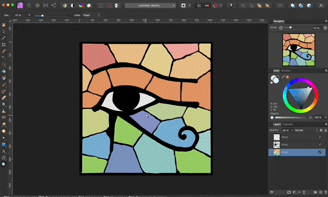
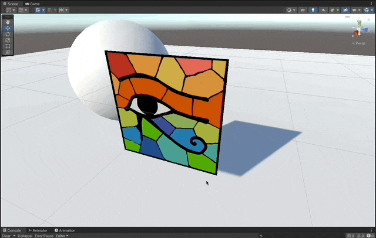
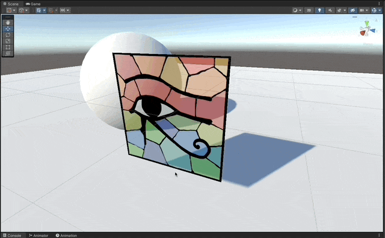
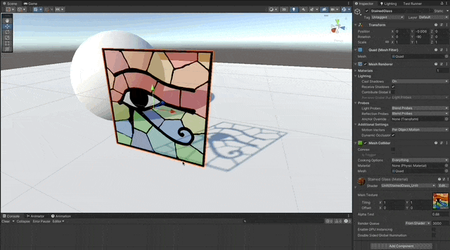
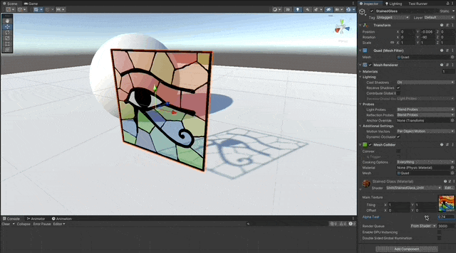

# Transparent Shaders

Written in Cg for the Built-in RP in **Unity 2021.3.10f1**

### References

- [Unity Shaders course by Nik Lever](https://www.udemy.com/course/learn-unity-shaders-from-scratch)

## Shaders

- [Using Standard Surface Shader](#using-standard-surface-shader)

---

## Using Standard Surface Shader

### Create a texture with alpha channel



### Write the first Pass of the Standard Surface Channel

1. Create a standard surface shader and connect the main texture to the albedo.
1. Set the `RenderType` and `Queue` tags to `Transparent` to ensure it renders in front of the geometry of the scene.
1. Disable the `ZWrite` for good practice.
1. Add `alpha:fade` to the pragma directive, to be able to control the alpha of the pixels

```c
Tags { "RenderType"="Transparent" }
Tags { "Queue"="Transparent" }
LOD 100

// good practice
ZWrite Off

CGPROGRAM
#pragma surface surf Lambert alpha:fade
```

```c
void surf (Input IN, inout SurfaceOutput o)
{
   fixed4 color = tex2D(_MainTex, IN.uv_MainTex);
   o.Albedo = color.rgb;
   o.Alpha = color.a;
}
ENDCG
```




### Write a second Pass for the Shadows

1. Define a second `CGPROGRAM` in the surface shader, to generate a second pass.
1. Add `ColorMask 0` to make sure this shader doesn't write to the `Frame Buffer`.
1. Add `alphatest:_AlphaTest addshadow` to the pragma directive, so it clips out pixels that don't pass the alpha threshold and it casts `shadows`.

```c
ColorMask 0

CGPROGRAM
#pragma surface surf Lambert alpha:fade alphatest:_AlphaTest addshadow
...
ENDCG
```



