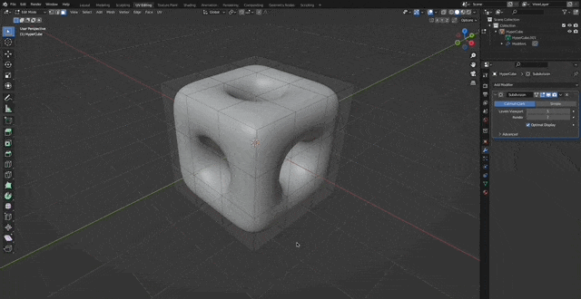

# Transparent Shaders

Written in Cg for the Built-in RP in **Unity 2021.3.10f1**

### References

- [Unity Shaders course by Nik Lever](https://www.udemy.com/course/learn-unity-shaders-from-scratch)

## Shaders

- [Using Standard Surface Shader](#using-standard-surface-shader)
- [Using Unlit Shader](#using-unlit-shader)

---

## Using Standard Surface Shader

### Create a texture with alpha channel


### Write the first Pass of the Standard Surface Channel

1. Create a standard surface shader and connect the main texture to the albedo.
1. Set the `RenderType` and `Queue` tags to `Transparent` to ensure it renders in front of the geometry of the scene.
1. Disable the `ZWrite` for good practice.
1. Add `alpha:fade` to the pragma directive, to be able to control the alpha of the pixels

```c
Tags { "RenderType"="Transparent" }
Tags { "Queue"="Transparent" }
LOD 100

// good practice
ZWrite Off

CGPROGRAM
#pragma surface surf Lambert alpha:fade
```

```c
void surf (Input IN, inout SurfaceOutput o)
{
   fixed4 color = tex2D(_MainTex, IN.uv_MainTex);
   o.Albedo = color.rgb;
   o.Alpha = color.a;
}
ENDCG
```


### Write a second Pass for the Shadows

1. Define a second `CGPROGRAM` in the surface shader, to generate a second pass.
1. Add `ColorMask 0` to make sure this shader doesn't write to the `Frame Buffer`.
1. Add `alphatest:_AlphaTest addshadow` to the pragma directive, so it clips out pixels that don't pass the alpha threshold and it casts `shadows`.

```c
ColorMask 0

CGPROGRAM
#pragma surface surf Lambert alpha:fade alphatest:_AlphaTest addshadow
...
ENDCG
```


## Using Unlit Shader

### Create a mesh



### Normal Map and GrabPass

1. Create an unlit shader with a main texture, a normal map and a sky box property.
1. Define a `_RefractionStrength` value to be able to parametrize the refraction effect.

1. Set the `RenderType` and `Queue` tags to `Transparent` to ensure it renders in front of the geometry of the scene.

1. Use `GrabPass` to get a texture with the current pixels in the Frame Buffer that are behind the object.
1. Use `ComputeGrabScreenPos` to calculate the uvs to use in the grab pass texture.
1. Use [tex2Dproj](https://developer.download.nvidia.com/cg/tex2Dproj.html) and `UNITY_PROJ_COORD` with the previously calculated uvs, to get the pixel from the grab pass texture.
1. Use the normal map to distort the grab pass texture.

```c
_MainTex ("Texture", 2D) = "white" {}
_NormalMap ("Normal Map", 2D) = "bump" {}
_SkyBox ("Sky Box", CUBE) = "cube" {}
_RefractionStrength ("Refraction Strength", Range(0,2)) = 0.2
```

```c
Tags { "RenderType"="Transparent" }
Tags { "Queue"="Transparent" }
LOD 100

GrabPass {
   "_GrabTexture"
}
```

```c
struct v2f
{
   float4 uv_Grab : TEXCOORD2;
};

v2f vert (appdata v)
{
   float4 vertexClipPos = UnityObjectToClipPos(v.vertex);
   o.uv_Grab = ComputeGrabScreenPos(vertexClipPos);
}

fixed4 frag (v2f i) : SV_Target
{
   fixed4 normal = tex2D(_NormalMap, i.uv_Normal);
   half4 refraction = normal.rgba;

   i.uv_Grab += refraction * _RefractionStrength;

   fixed4 grabColor = tex2Dproj(_GrabTexture, UNITY_PROJ_COORD(i.uv_Grab));

   return color * grabColor;
}
```


